# 🛍️ E-commerce Android App

Offline first E-commerce application built with Kotlin. 
It features data synchronization, real-time updates and simulated backend environment for notifications. 

## 📱Screenshots
* **Sign in & Sign up**\
  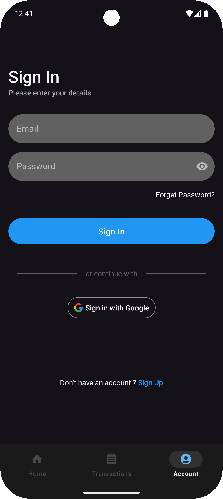 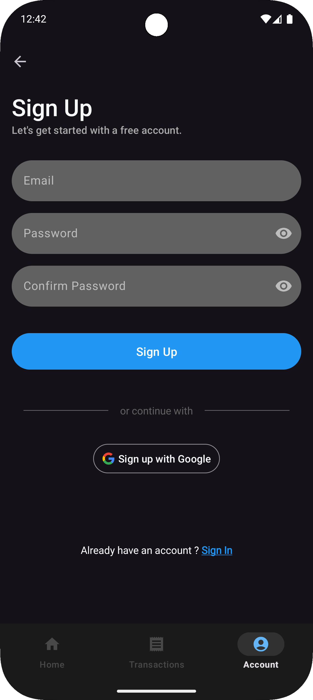
* **Home & Search**\
  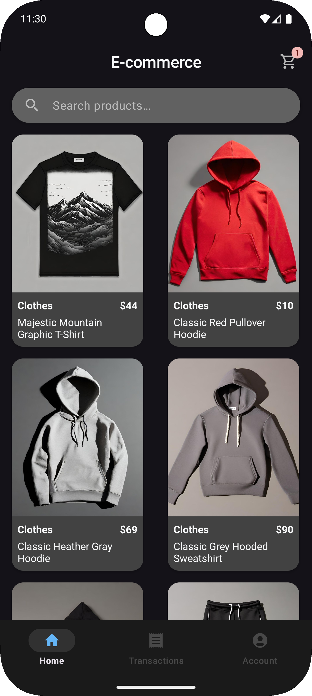 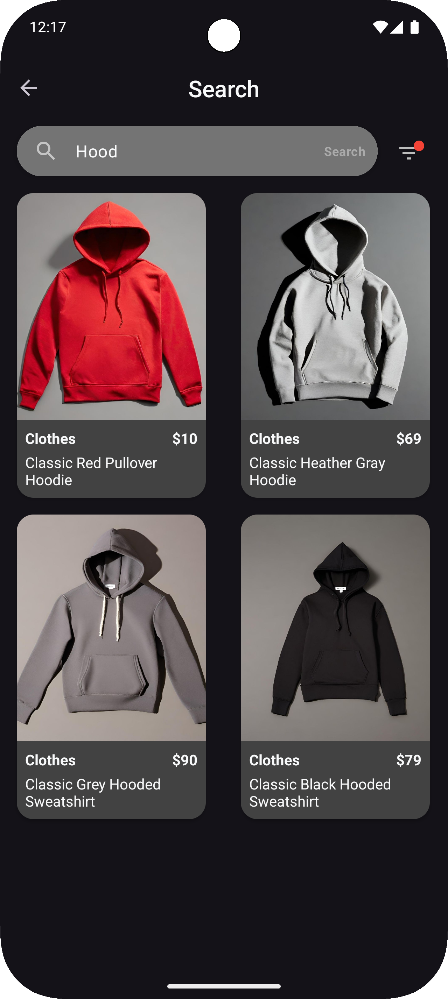 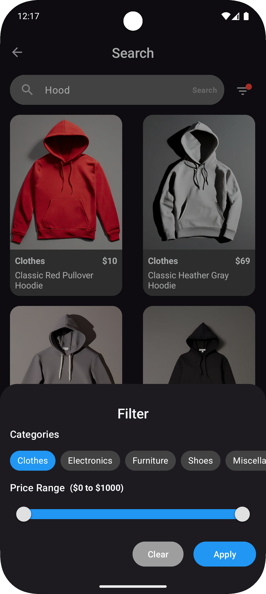
* **Checkout Flow**\
  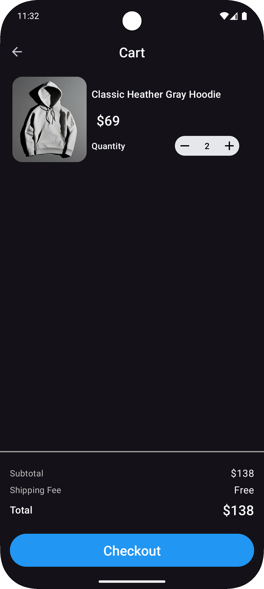 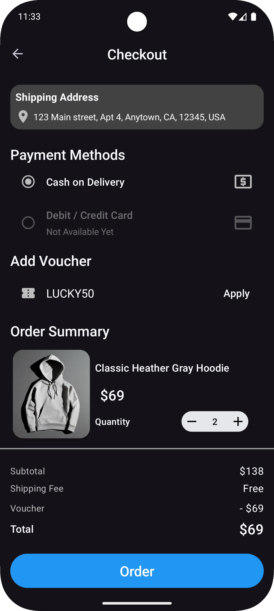
* **Transactions**\
  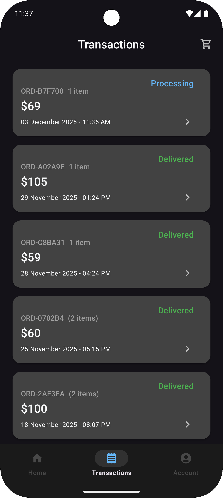 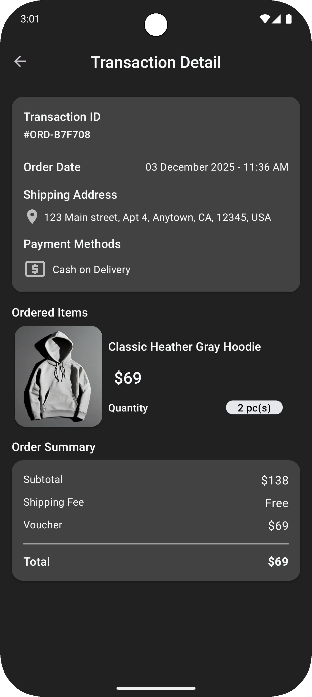
* **Account & Vouchers**\
  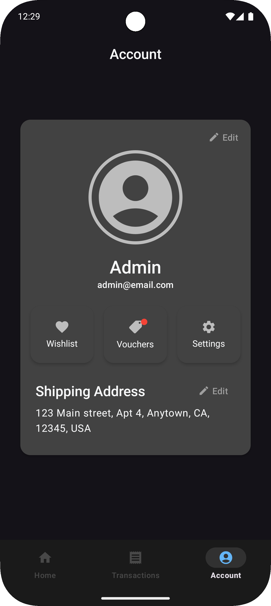 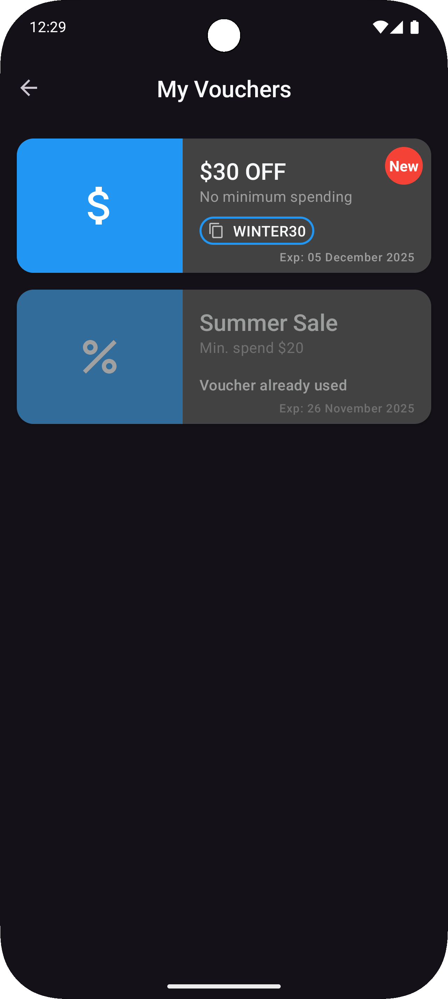 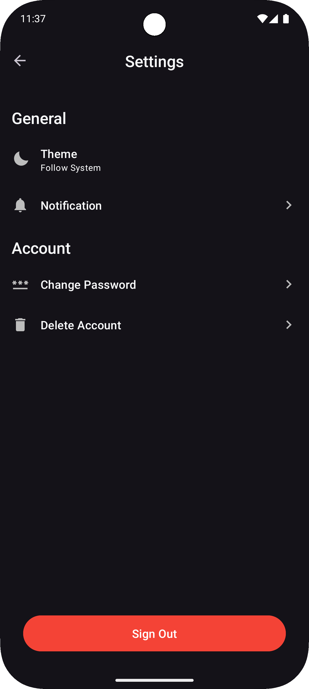

## 🌟️ Key Features
* **Authentication**
  * Email/Password & Google Sign In
  * Sync user profile
* **Product Browsing**
  * Paging 3 + RemoteMediator
  * Offline support
* **Voucher System**
  * Auto distribution, public voucher appear automatically in user account
  * Real time listener 
* **Simulated Backed Notifications**
  * Uses WorkManager to simulate server side events (Transaction Status, New Voucher) when the app is closed

## 🛠️ Tech Stack
* **Language :** Kotlin
* **Architecture :** Clean Architecture (Multi-Module) + MVVM
* **Dependency Injection :** Dagger Hilt
* **Network :** Retrofit, OkHttp, Platzi Fake Store API
* **Cloud & Auth :** Firebase Firestore, Firebase Auth
* **Local Database :** Room(SQLite)
* **Asynchronicity :** Coroutines & Flow
* **Background Work :** WorkManager
* **UI :** XML, ViewBinding, Material Components 3

## 🏗️ Architecture
* **Single Source of Truth :** The UI observe the Local Database (Room)
* **Sync Strategy :** Repositories fetch data from Firestore and save it to Room
* **Background Notification :** Using WorkManager to simulate backend, worker runs every 15 minutes to check Transaction Status, Wishlist Product Status, and New Public Vouchers.